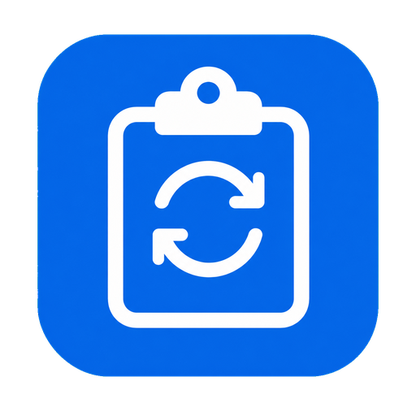

# ClipBridge

<p align="center">
  
</p>

ClipBridge 是一个局域网剪贴板同步工具。目前支持 Windows 与 Android 双向同步文字和图片，macOS 26+ 版本的开发说明见 [MACOS_HANDOFF.md](MACOS_HANDOFF.md)。

当前稳定版本：**1.2.1**

## 功能

- Windows 与 Android 双向同步纯文本剪贴板
- Windows 与 Android 双向同步图片剪贴板，单张原文件最大 20 MB
- 常见输入格式：PNG、JPG/JPEG/JFIF、BMP、GIF、TIFF、WebP、HEIC/HEIF、AVIF、ICO
- 能取得原文件/URI 时直接传输原始图片，不解码、不转码；GIF 保留完整动画
- 只有剪贴板仅提供位图时才转成 PNG，超过 20 MB 时自动使用高质量 JPEG
- 使用同一条 TCP 连接完成双向通信
- HMAC-SHA256 配对认证，配对码至少 4 位
- Windows 使用 `WM_CLIPBOARDUPDATE` 监听，不定时轮询剪贴板
- Windows 收到文本后直接写入系统剪贴板；若已启用 `Win+V` 剪贴板历史，通常会被系统记录
- Windows 最小化或关闭窗口后驻留系统托盘
- Windows 可开启当前用户登录后的自动启动；配对码仅以 Windows 当前用户加密形式保存
- Android 使用前台服务维持连接
- Android 通知栏提供“同步当前剪贴板”按钮
- Android 已捕获的待发送文本、Windows 收到的待写文本均按 FIFO 顺序处理，队列最多保留 20 条
- 远端来源标记和消息 UUID 防止循环回写

## 下载

- [ClipBridge Windows 1.2.1](dist/ClipBridge-Windows-v1.2.1.zip)
- [ClipBridge Android 1.2.1](dist/ClipBridge-Android-v1.2.1.apk)

Windows 包是 .NET 8 框架依赖版本，需要安装 [.NET 8 Desktop Runtime](https://dotnet.microsoft.com/download/dotnet/8.0)。

Android APK 使用 Release keystore 签名，可用于正式分发。签名私钥不在仓库中；必须妥善备份，后续版本需要使用同一把 keystore 才能覆盖升级。

若已安装此前的 Debug 签名测试包，首次安装此 Release 版前需要先卸载旧包；这是 Android 对不同签名证书的安全要求，卸载会清除应用内保存的 Windows IP 和配对码。

## 使用方法

### Windows

1. 解压 `ClipBridge-Windows-v1.2.1.zip`。
2. 运行 `ClipBridge.Windows.exe`。
3. 记下窗口中显示的 Windows 局域网 IPv4。
4. 输入至少 4 位配对码，点击“开始同步”。
5. Windows 防火墙首次询问时允许“专用网络”访问。

最小化或点击关闭按钮后，程序会隐藏到系统托盘并继续同步。双击托盘图标恢复窗口，右键选择“退出”才会真正停止。

填写配对码后可点击“开启开机自启动”。之后 Windows 当前用户登录时，ClipBridge 会自动启动同步并隐藏到托盘；配对码仅以该 Windows 用户可解密的形式保存在本机。

### Android

1. 安装 `ClipBridge-Android-v1.2.1.apk`。
2. 填写 Windows 的局域网 IPv4 和相同配对码。
3. 点击“开始同步”并允许通知权限；通知栏“一键同步当前剪贴板”会默认启用。
4. 在其他应用复制文字后，下拉通知栏并点击“同步当前剪贴板”。

Android 10+ 不允许普通后台应用读取其他应用的剪贴板。ClipBridge 在获得输入焦点时可以读取当前剪贴板，因此也可以在复制后返回 ClipBridge 完成同步。

## Android 剪贴板限制

Android 普通应用只能读取当前 `primaryClip`，不能读取三星或其他输入法保存的私有剪贴板历史。

因此：

- 在其他应用连续复制 A、B、C，最后只点击一次“一键同步”，ClipBridge 只能读取当前的 C。
- 每次复制后都点击一次“一键同步”，A、B、C 会按顺序发送；若 Windows 已启用 `Win+V` 剪贴板历史，通常会被系统记录。
- Windows 发往 Android 的内容会依次写入 Android 系统剪贴板；输入法是否长期保留由输入法自身决定。

要在 Android 上做到完全后台自动捕获，需要把应用实现为并启用为默认输入法；1.2.1 版本不包含此模式。

## 网络要求

- Windows 与 Android 位于同一局域网
- 路由器未启用客户端隔离
- TCP 端口 `45837` 可访问
- Android 主动连接 Windows；Windows 作为 TCP 服务端
- 当前桌面端只保留一个活动 Android 连接

## 安全说明

每条消息带有 HMAC-SHA256，用于验证配对码并检测内容篡改。协议详情见 [protocol/PROTOCOL.md](protocol/PROTOCOL.md)。

4 位只是最低长度，抗猜测能力很弱，建议使用至少 8 位随机配对码。当前 1.2.1 版本的局域网内容仍以明文传输；HMAC 只提供认证与完整性校验，不提供加密，也不能抵御截获后的离线猜码。请只在可信局域网中使用，不要将 TCP 45837 暴露到公网。后续版本可使用 TLS/Noise 加密并保存已配对设备公钥。

## 从源码构建

### Windows

要求：

- Windows 10/11
- .NET 8 SDK

```powershell
dotnet build windows\ClipBridge.Windows\ClipBridge.Windows.csproj -c Release
dotnet publish windows\ClipBridge.Windows\ClipBridge.Windows.csproj `
  -c Release `
  -o artifacts\windows
```

### Android

要求：

- JDK 17
- Android SDK 35

Windows：

```powershell
cd android
.\gradlew.bat :app:assembleDebug
```

macOS/Linux：

```bash
cd android
./gradlew :app:assembleDebug
```

APK 输出：

```text
android/app/build/outputs/apk/debug/app-debug.apk
```

构建正式 Release APK 前，将 `android/keystore.properties.example` 复制为 `android/keystore.properties`，填入本机 Release keystore 路径、别名和密码；该文件和 keystore 均已被 Git 忽略。

```powershell
cd android
.\gradlew.bat :app:assembleRelease
```

Release APK 输出：

```text
android/app/build/outputs/apk/release/app-release.apk
```

## 项目结构

```text
android/                 Android Kotlin + Compose 源码
windows/                 Windows WPF 源码
protocol/                TCP/HMAC 线协议
assets/icons/            共用应用图标
dist/                    1.2.1 可安装产物
MACOS_HANDOFF.md         macOS 26+ 开发交接
CHANGELOG.md             版本说明
```

## macOS

macOS 端尚未提交实现。计划使用 SwiftUI、AppKit、Network.framework 与 CryptoKit，最低支持 macOS 26.0。完整协议、工程结构、权限和联调步骤见 [MACOS_HANDOFF.md](MACOS_HANDOFF.md)。

## 许可证

本项目以 [MIT License](LICENSE) 开源。
