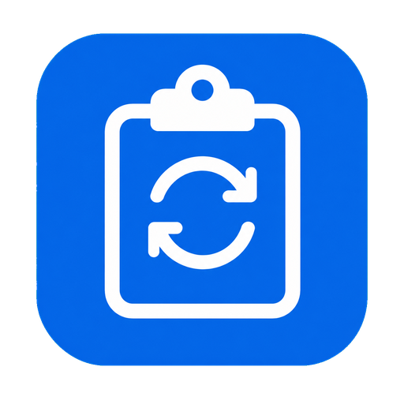

# ClipBridge

<p align="center">
  
</p>

[中文](#clipbridge) | [English](#english)

ClipBridge 是一个局域网剪贴板同步工具。目前支持 Windows 与 Android 双向同步文字和图片，macOS 26+ 版本的开发说明见 [MACOS_HANDOFF.md](MACOS_HANDOFF.md)。

当前稳定版本：**1.3.0**

v1.3 主要优化大图片传输及发送完成后的内存回收。连接方向已调整，需要同时更新两端：Windows 填手机 IP，Android 自动显示 Wi-Fi IP 并监听连接。

由于旧正式签名文件已遗失，Android v1.3 使用新的正式签名，安装标识仍为 `com.clipbridge.app`。无法直接覆盖 v1.2.3：请先记录配对码，卸载旧正式版再安装 v1.3，并重新配置。测试版独立安装，请勿同时开启两版同步。

## 功能

- Windows 与 Android 双向同步纯文本剪贴板
- Windows 与 Android 双向同步图片剪贴板，单张原文件最大 100 MB
- 两端支持的常见图片格式：PNG、JPG/JPEG/JFIF、BMP、GIF、TIFF、WebP、AVIF、ICO
- Android 额外支持 HEIC/HEIF，转换为 PNG 后同步（转换后仍须不超过 100 MB）；Windows 不直接处理 HEIC/HEIF 文件
- 其他格式能取得原文件/URI 时直接传输原始图片，不解码、不转码；GIF 保留完整动画
- 只有剪贴板仅提供位图时才转成 PNG，超过 100 MB 时自动使用高质量 JPEG
- 使用同一条 TCP 连接完成双向通信
- HMAC-SHA256 配对认证，配对码至少 4 位
- Windows 使用 `WM_CLIPBOARDUPDATE` 监听，不定时轮询剪贴板
- Windows 收到文本后直接写入系统剪贴板；若已启用 `Win+V` 剪贴板历史，通常会被系统记录
- Windows 最小化或关闭窗口后驻留系统托盘
- Windows 可开启当前用户登录后的自动启动；配对码仅以 Windows 当前用户加密形式保存
- Android 使用前台服务维持连接
- Android 通知收起时只显示“点击同步到电脑”标题，直接点按即可同步当前剪贴板；展开后可点击“打开设置”，详细状态在应用内显示
- 待发送/待写内容按 FIFO 保留在内存中；最多 20 项，常规队列预算 64 MiB，大项目仅可单独排队；满队列提示重试，不覆盖旧内容
- 对端写入剪贴板并返回认证 ACK 后释放发送内容；失败保留并重试，停止同步/退出会丢失未完成内容
- Windows 大图处理后空闲约 2 秒主动回收临时内存，随后清理已完成终结的资源；小文本不触发主动全堆回收，任务管理器占用仍包括运行时、图像组件和当前剪贴板资源。详见 [内存验证记录](tests/MEMORY_RECLAMATION.md)
- 去重记录最多 4096 条；图片缓存按 50 个、256 MB、7 天清理，当前剪贴板引用的文件受保护，较旧的历史文件链接可能失效
- 远端来源标记和消息 UUID 防止循环回写

## 下载

- [ClipBridge Windows 1.3.0](https://github.com/yeamu/ClipBridge/releases/download/v1.3/ClipBridge-Windows-v1.3.zip)
- [ClipBridge Android 1.3.0](https://github.com/yeamu/ClipBridge/releases/download/v1.3/ClipBridge-Android-v1.3.apk)

Windows x64 包包含 .NET 8 运行时，解压整个文件夹后运行，无需另装运行时；请保留 EXE 旁的 DLL。

Android APK 使用正式 Release keystore 签名。正式签名文件和密码仅保存在本机，均被 Git 忽略，不上传 GitHub；请离线备份两者。后续覆盖升级必须使用相同签名。

本次签名变更仅发生在 v1.3；后续版本应沿用此签名和安装标识。签名及构建说明见 [android/signing/README.md](android/signing/README.md)。

## 使用方法

### Windows

1. 解压 v1.3 Windows 包（与手机端一起更新）。
2. 运行 `ClipBridge.Windows.exe`。
3. 填写手机 ClipBridge 页面自动显示的 Wi-Fi IPv4。Windows 会主动连接此地址并保存设置；修改前请先停止同步。旧的本机 IP 设置不会作为手机 IP 继续使用。
4. 输入至少 4 位配对码，点击“开始同步”。
5. Windows 自动重试连接手机的 TCP 45837 端口，无需创建 Windows 入站防火墙规则或管理员授权。

最小化或点击关闭按钮后，程序会隐藏到系统托盘并继续同步。双击托盘图标恢复窗口，右键选择“退出”才会真正停止。

填写配对码后可点击“开启开机自启动”。之后 Windows 当前用户登录时，ClipBridge 会自动启动同步并隐藏到托盘；配对码仅以该 Windows 用户可解密的形式保存在本机。

### Android

1. 安装 v1.3 Android APK（与 Windows 端一起更新）。
2. 连接 Wi-Fi，页面会自动显示手机 IPv4；将它填到 Windows 端，两端输入相同配对码。
3. 点击“开始同步”并允许通知权限；通知栏“一键同步当前剪贴板”会默认启用。
4. 在其他应用复制文字或图片后，下拉通知栏，点按“点击同步到电脑”通知即可同步。通知不显示正文；展开后点击“打开设置”可进入 ClipBridge 查看状态和设置。

同步服务运行期间，切换或重新连接 Wi-Fi、Wi-Fi IPv4 变化后，会重新监听新地址并自动尝试同步一次；重复网络回调不会重复触发。已读取的内容会排队，待 Windows 连接且配对成功后发送。断开 Wi-Fi 时暂停监听，重新连接后恢复；手动停止服务后不再自动同步。手机 IP 改变时，请在 Windows 停止同步并更新地址。

Android 10+ 不允许普通后台应用读取其他应用的剪贴板。ClipBridge 在获得输入焦点时可以读取当前剪贴板，因此也可以在复制后返回 ClipBridge 完成同步。

## Android 剪贴板限制

Android 普通应用只能读取当前 `primaryClip`，不能读取三星或其他输入法保存的私有剪贴板历史。

因此：

- 在其他应用连续复制 A、B、C，最后只点击一次“一键同步”，ClipBridge 只能读取当前的 C。
- 每次复制后都点击一次“一键同步”，A、B、C 会按顺序发送；若 Windows 已启用 `Win+V` 剪贴板历史，通常会被系统记录。
- Windows 发往 Android 的内容会依次写入 Android 系统剪贴板；输入法是否长期保留由输入法自身决定。

要在 Android 上做到完全后台自动捕获，需要把应用实现为并启用为默认输入法；1.3.0 版本不包含此模式。

## 网络要求

- Windows 与 Android 位于同一局域网
- 路由器未启用客户端隔离
- TCP 端口 `45837` 可访问
- Windows 主动连接 Android；Android 仅在当前 Wi-Fi IPv4 上监听 TCP 45837
- 每台手机同时处理一个 Windows 连接；双方断开后 Windows 自动重连

## 安全说明

每条消息带有 HMAC-SHA256，用于验证配对码并检测内容篡改。协议详情见 [protocol/PROTOCOL.md](protocol/PROTOCOL.md)。

4 位只是最低长度，抗猜测能力很弱，建议使用至少 8 位随机配对码。当前 1.3.0 版本的局域网内容仍以明文传输；HMAC 只提供认证与完整性校验，不提供加密，也不能抵御截获后的离线猜码。请只在可信局域网中使用，不要将 TCP 45837 暴露到公网。后续版本可使用 TLS/Noise 加密并保存已配对设备公钥。

## 从源码构建

### Windows

要求：

- Windows 10/11
- .NET 8 SDK

```powershell
dotnet build windows\ClipBridge.Windows\ClipBridge.Windows.csproj -c Release
dotnet publish windows\ClipBridge.Windows\ClipBridge.Windows.csproj `
  -c Release -r win-x64 --self-contained true -p:PublishSingleFile=true `
  -o artifacts\windows
```

托盘图标 DPI 回归检查（Windows）：

```powershell
dotnet run --project windows\ClipBridge.IconChecks\IconChecks.csproj -c Release
```

连接和换网的自动检查命令、真机联调步骤见 [tests/CONNECTION_CHECKS.md](tests/CONNECTION_CHECKS.md)。

检查 100%–400% 缩放下的图标尺寸，以及原始 ICO 各尺寸的像素一致性。实际显示效果可在 4K 屏幕上切换 150%、175%、200% 缩放，并在窗口隐藏到托盘时重复检查。

### Android

要求：

- JDK 17
- Android SDK 35

Windows：

```powershell
cd android
.\gradlew.bat :app:assembleDebug
```

macOS/Linux：

```bash
cd android
./gradlew :app:assembleDebug
```

APK 输出：

```text
android/app/build/outputs/apk/debug/app-debug.apk
```

构建正式 Release APK 前，将 `android/keystore.properties.example` 复制为 `android/keystore.properties`，填入本机 Release keystore 路径、别名和密码；该文件和 keystore 均已被 Git 忽略。

```powershell
cd android
.\gradlew.bat :app:assembleRelease
```

Release APK 输出：

```text
android/app/build/outputs/apk/release/app-release.apk
```

## 项目结构

```text
android/                 Android Kotlin + Compose 源码
windows/                 Windows WPF 源码
protocol/                TCP/HMAC 线协议
assets/icons/            共用应用图标
dist/                    历史 1.2.3 安装包（v1.3 在 GitHub Releases 下载）
MACOS_HANDOFF.md         macOS 26+ 开发交接
CHANGELOG.md             版本说明
```

## macOS

macOS 端尚未提交实现。计划使用 SwiftUI、AppKit、Network.framework 与 CryptoKit，最低支持 macOS 26.0。完整协议、工程结构、权限和联调步骤见 [MACOS_HANDOFF.md](MACOS_HANDOFF.md)。

## 许可证

本项目以 [MIT License](LICENSE) 开源。

---

## English

ClipBridge is a LAN clipboard synchronization tool for bidirectional text and single-image sync between Windows and Android. The macOS 26+ implementation handoff is available in [MACOS_HANDOFF.md](MACOS_HANDOFF.md).

Current stable version: **1.3.0**

v1.3 focuses on large-image memory use and reclamation after successful delivery. Update both apps: Windows connects to the phone IP, and Android displays its Wi-Fi IP automatically.

The previous release signing key was lost. Android v1.3 uses a new release key with the same app ID `com.clipbridge.app`, so it cannot update v1.2.3 in place. Record your pairing code, uninstall the old stable app, install v1.3 and configure it again. Debug builds install separately.

### Features

- Bidirectional plain-text and single-image clipboard sync between Windows and Android.
- Original image size limit: 100 MB. Both platforms support PNG, JPG/JPEG/JFIF, BMP, GIF, TIFF, WebP, AVIF, and ICO.
- Android additionally supports HEIC/HEIF and converts it to PNG before syncing; the PNG must also fit within 100 MB. Windows does not handle HEIC/HEIF files directly.
- For other formats, when an original file or URI is available, its bytes are transferred directly without decoding or transcoding. Animated GIFs retain all frames.
- Only bitmap-only clipboard data is encoded as PNG; when that exceeds 100 MB, high-quality JPEG is attempted automatically.
- One TCP connection carries both directions, with HMAC-SHA256 pairing-code and message-integrity verification.
- Windows uses native clipboard events, stays in the system tray after minimizing or closing the window, and can auto-start for the current user.
- Android uses a foreground service. Its collapsed notification shows only the title “点击同步到电脑” (Tap to sync to computer); tap it to sync or expand it to use **Open settings**. Detailed status is shown in the app.
- Pending content stays in bounded RAM queues (20 items, a 64 MiB regular budget, one oversized item allowed alone). Full queues reject new content with a status message.
- Items are released only after an authenticated successful clipboard-write ACK. Failed items retry; stopping/exiting loses unfinished items. Both apps must be updated for ACK support.
- Windows reclaims large temporary buffers after roughly two seconds of idle time, with a later pass for finalized resources. Small text does not force full collections. Process memory still includes runtime/image caches and the current clipboard; see [memory verification](tests/MEMORY_RECLAMATION.md).
- Deduplication retains 4096 IDs. Old clipboard files are pruned to 50 files/256 MB/seven days, preserving current references; older history links may expire.

### Downloads

- [GitHub Releases](https://github.com/yeamu/ClipBridge/releases/latest)
- [Windows 1.3.0 ZIP](https://github.com/yeamu/ClipBridge/releases/download/v1.3/ClipBridge-Windows-v1.3.zip)
- [Android 1.3.0 APK](https://github.com/yeamu/ClipBridge/releases/download/v1.3/ClipBridge-Android-v1.3.apk)

The Windows x64 package includes the .NET 8 runtime. Extract the whole folder and keep the DLLs alongside the executable. The Android APK uses a release keystore. The signing key and password stay local and are ignored by Git; neither is uploaded to GitHub. Back up both, and reuse this key for future updates.

Do not run sync in both stable and debug apps simultaneously. Future stable releases must retain the v1.3 signing key and app ID; see [signing notes](android/signing/README.md).

### Quick start

#### Windows

1. Extract the v1.3 Windows package and run `ClipBridge.Windows.exe`; update Android at the same time.
2. Enter the Wi-Fi IPv4 displayed by ClipBridge on the phone. Windows connects to and saves this address; stop sync before changing it. Old local-adapter addresses are not reused as phone addresses.
3. Enter a pairing code with at least four characters and click **Start sync**.
4. Windows retries connecting to the phone on TCP 45837 automatically. No Windows inbound firewall rule or administrator prompt is needed.

Minimizing or closing the window keeps ClipBridge running in the system tray. Double-click the tray icon to restore the window; choose **Exit** in the tray menu to stop it. You can enable auto-start after entering a pairing code. The code is stored in a form decryptable only by the current Windows user.

#### Android

1. Install the v1.3 Android APK; update Windows at the same time.
2. Connect to Wi-Fi. The phone IPv4 is displayed automatically; enter it on Windows and use the same pairing code on both devices.
3. Tap **Start sync** and grant notification permission.
4. After copying content in another app, open the notification shade and tap the ClipBridge notification to sync. It has no body; expand it and tap **Open settings** to view status or settings in ClipBridge. Returning to ClipBridge after copying can also trigger synchronization.

While sync is running, changing or reconnecting Wi-Fi (or changing its IPv4) rebinds the phone listener and attempts one clipboard sync. Duplicate network callbacks do not retrigger it. Captured content waits for a verified Windows connection. If the phone IP changes, update it on Windows. Stopping sync disables this behavior. If background clipboard access is blocked, tap the notification or return to the app.

### Android clipboard limitations

On Android 10 and later, regular background apps cannot read other apps' clipboards. ClipBridge can read only the current system `primaryClip`; it cannot bulk-read private clipboard histories maintained by Samsung Keyboard or other IMEs.

- If you copy A, B, and C and synchronize only once, only the latest item, C, can be sent.
- Synchronize after each copy to send A, B, and C in order.
- Content received from Windows is written to the Android system clipboard in order. Whether an IME retains it is controlled by that IME.
- Fully automatic background capture requires implementing and enabling ClipBridge as the default keyboard; version 1.3.0 does not include that mode.

### Network and security

- Both devices must be on the same LAN and client isolation must be disabled.
- TCP port `45837` must be reachable on the phone. Windows initiates and retries the connection; Android accepts one active Windows connection at a time.
- Every message is authenticated with HMAC-SHA256. See [protocol/PROTOCOL.md](protocol/PROTOCOL.md).
- Four characters are only the minimum. Use a random pairing code of at least eight characters.
- Payloads are not encrypted in version 1.3.0. HMAC provides authentication and integrity, not confidentiality. Use ClipBridge only on trusted LANs and never expose its TCP port to the public internet.

### Build from source

#### Windows

Requirements: Windows 10/11 and the .NET 8 SDK.

```powershell
dotnet build windows\ClipBridge.Windows\ClipBridge.Windows.csproj -c Release
dotnet publish windows\ClipBridge.Windows\ClipBridge.Windows.csproj `
  -c Release -r win-x64 --self-contained true -p:PublishSingleFile=true `
  -o artifacts\windows
```

#### Android

Requirements: JDK 17 and Android SDK 35.

```powershell
cd android
.\gradlew.bat :app:assembleDebug
```

On macOS/Linux, use `./gradlew :app:assembleDebug`. The Debug APK is written to `android/app/build/outputs/apk/debug/app-debug.apk`.

Before building a Release APK, copy `android/keystore.properties.example` to `android/keystore.properties` and provide the local keystore path, alias, and passwords. Both that file and keystores are ignored by Git.

```powershell
cd android
.\gradlew.bat :app:assembleRelease
```

The Release APK is written to `android/app/build/outputs/apk/release/app-release.apk`.

### macOS and license

The macOS implementation has not been committed yet. It is planned as a macOS 26.0+ app using SwiftUI, AppKit, Network.framework, and CryptoKit. See [MACOS_HANDOFF.md](MACOS_HANDOFF.md) for the full handoff.

ClipBridge is released under the [MIT License](LICENSE).
